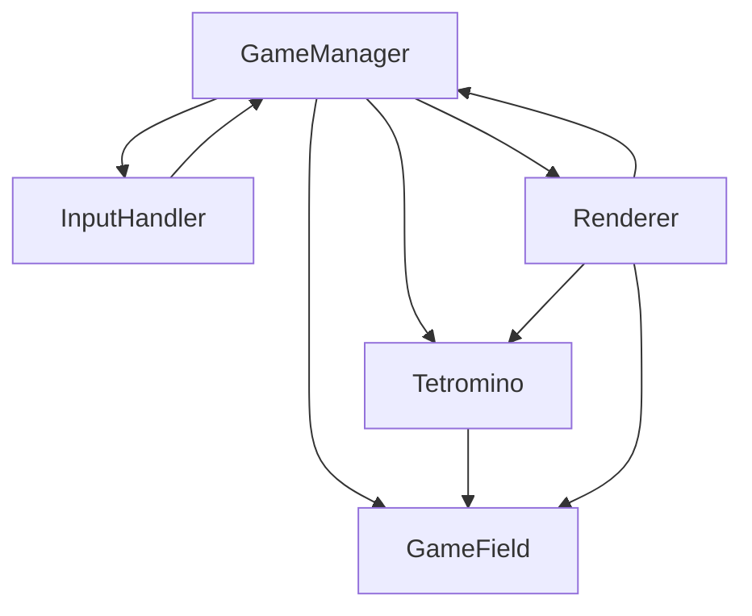

# 基本設計書 - HTMLテトリス

## 全体アーキテクチャ

```
┌─────────────────────────────────────┐
│            index.html               │
├─────────────────────────────────────┤
│  HTML Structure                     │
│  - Canvas Element                   │
│  - UI Controls                      │
│  - Score Display                    │
├─────────────────────────────────────┤
│  CSS Styles                         │
│  - Responsive Layout                │
│  - Game UI Styling                  │
├─────────────────────────────────────┤
│  JavaScript Game Engine             │
│  ┌─────────────┬─────────────────┐  │
│  │Game Manager │ Tetromino       │  │
│  │- Game Loop  │ - Shape Data    │  │
│  │- State Mgmt │ - Rotation      │  │
│  │- Score Calc │ - Movement      │  │
│  └─────────────┼─────────────────┤  │
│  │Game Field   │ Input Handler   │  │
│  │- Grid Array │ - Keyboard      │  │
│  │- Collision  │ - Touch Events  │  │
│  │- Line Clear │ - Event Binding │  │
│  └─────────────┴─────────────────┘  │
└─────────────────────────────────────┘
```

## モジュール構成図

### 主要クラス・オブジェクト
1. **GameManager**: ゲーム全体の制御
2. **Tetromino**: テトロミノの管理
3. **GameField**: ゲームフィールドの状態管理
4. **InputHandler**: 入力制御
5. **Renderer**: 描画制御



## 外部インタフェース

### 画面構成
- **ゲーム画面**: Canvas要素（400x800px）
- **スコア表示**: 現在のスコア、レベル、消去ライン数
- **操作説明**: キーボード操作ガイド
- **ゲーム状態**: 開始/一時停止/ゲームオーバー

### API（なし）
- 外部APIとの通信は行わない

## データモデル概略

### ゲーム状態
```javascript
GameState = {
  field: Array[20][10],    // ゲームフィールド
  currentTetromino: Object, // 現在のテトロミノ
  score: Number,           // スコア
  level: Number,           // レベル
  lines: Number,           // 消去ライン数
  gameOver: Boolean,       // ゲーム終了フラグ
  paused: Boolean          // 一時停止フラグ
}
```

### テトロミノ構造
```javascript
Tetromino = {
  type: String,           // I,O,T,S,Z,J,L
  x: Number,              // X座標
  y: Number,              // Y座標
  rotation: Number,       // 回転状態(0-3)
  shape: Array[4][4]      // 形状配列
}
```

### テトロミノ定義
```javascript
TETROMINOES = {
  I: [[[1,1,1,1]]], // 直線
  O: [[[1,1],[1,1]]], // 正方形
  T: [[[0,1,0],[1,1,1]]], // T字
  S: [[[0,1,1],[1,1,0]]], // S字
  Z: [[[1,1,0],[0,1,1]]], // Z字
  J: [[[1,0,0],[1,1,1]]], // J字
  L: [[[0,0,1],[1,1,1]]]  // L字
}
```

## エラーハンドリング方針
- JavaScript例外のtry-catch処理
- Canvas描画エラーの無視（継続動作）
- 不正な入力値の検証とフィルタリング
- ブラウザ互換性問題の分岐処理

## ログ・監視方針
- console.logによるデバッグ情報出力
- ゲーム状態変化の記録
- エラー発生時の詳細ログ
- 本番環境ではログレベル調整

## セキュリティ方針
- 外部入力なし（XSS対策不要）
- ローカルストレージ使用なし
- 第三者ライブラリ使用なし

## 非機能要件への対応

### 性能
- requestAnimationFrame使用で60FPS維持
- 描画最適化（差分更新）
- メモリリーク防止

### 可用性
- エラー時の安全な停止
- 状態復元機能なし（シンプル重視）

### 保守性
- 機能別関数分割
- 定数の外部定義
- コメント記述

### 観測性
- ブラウザ開発者ツール対応
- デバッグモード準備